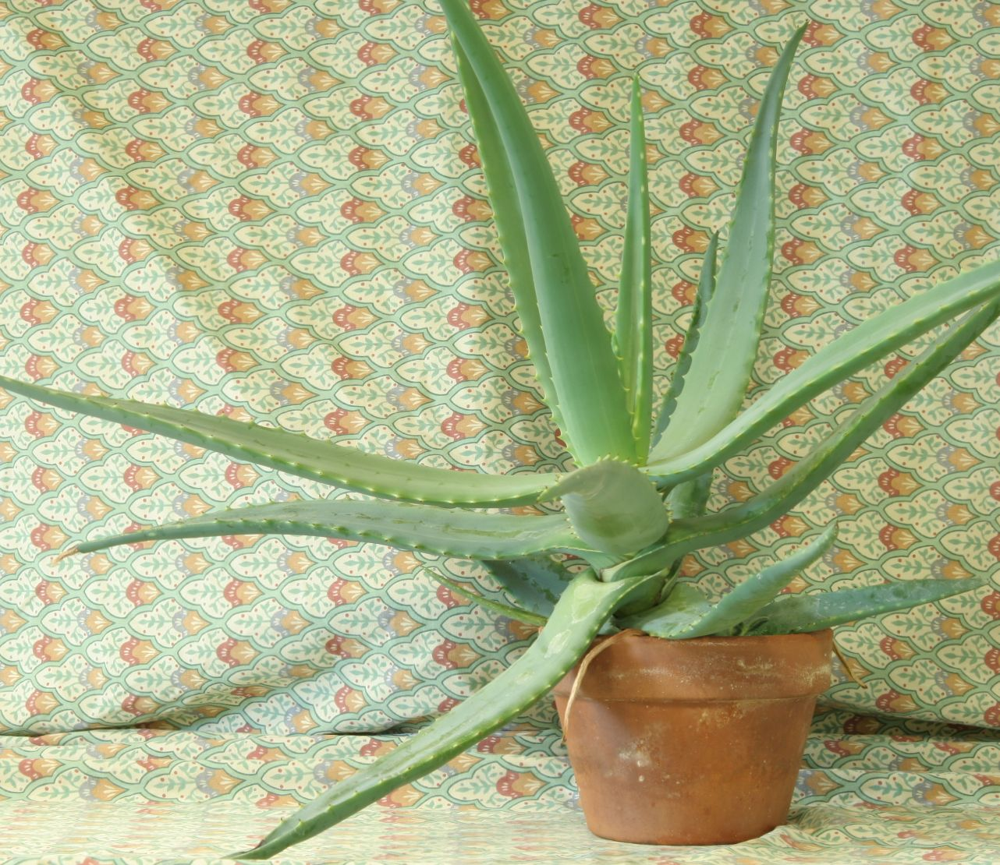
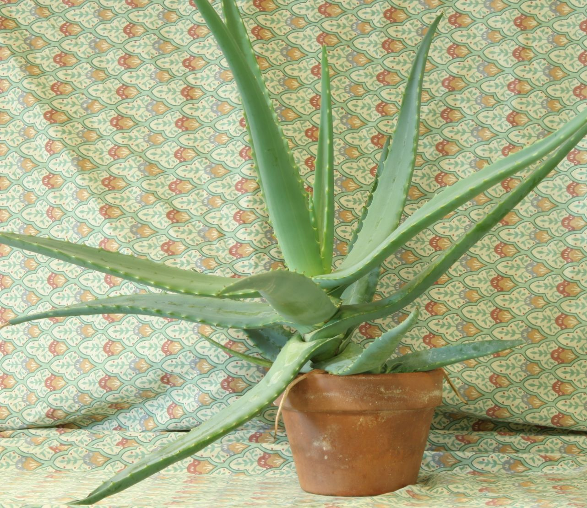
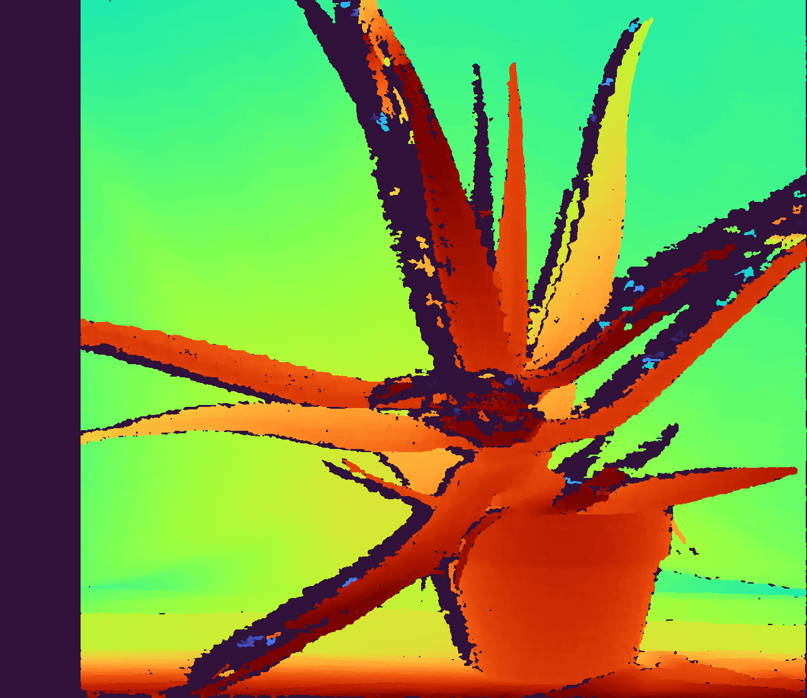
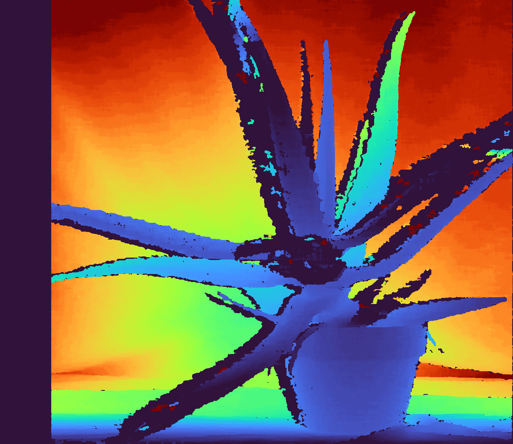

# OpenCV Stereo Depth Estimation

Stereo depth from a rectified left/right image pair using OpenCV Semi-Global Block Matching (SGBM).

## Setup

```bash
python -m venv .venv
.venv\Scripts\activate
pip install -r requirements.txt
```

## Run

```bash
python main.py
```

## Input

Left and right rectified stereo images:

| Left | Right |
|------|-------|
|  |  |

## Output

Colorized maps written by `main.py`:

| Disparity | Depth |
|-----------|-------|
|  |  |

- `disparity.png` — pixel shift between views (closer = higher disparity)
- `depth.png` — distance from camera (percentile-normalized for display)
